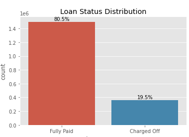
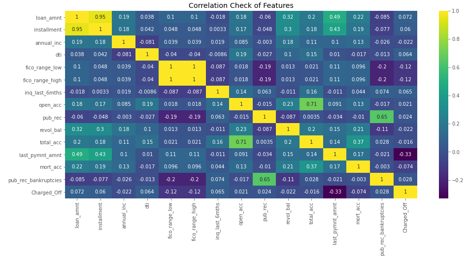

# Lending Club Credit Risk Analysis

LendingClub is an American peer-to-peer lending company, headquartered in San Francisco, California. It was the first peer-to-peer lender to register its offerings as securities with the Securities and Exchange Commission (SEC), and to offer loan trading on a secondary market. LendingClub is the world's largest peer-to-peer lending platform. The company claims that $15.98 billion in loans had been originated through its platform up to December 31, 2015.

[Dataset is available on Kaggle](https://www.kaggle.com/ethon0426/lending-club-20072020q1)

Date between 2007-2020, with ~3 million rows and 153 columns.

  

  